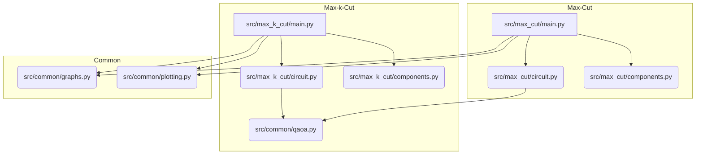

# QAOA per Max-Cut e Max-k-Cut

Questo progetto implementa l'algoritmo **Quantum Approximate Optimization Algorithm (QAOA)** per risolvere problemi di ottimizzazione combinatoria su grafi, nello specifico **Max-Cut** e **Max-k-Cut**.

L'implementazione utilizza **PennyLane**, una libreria cross-platform per il calcolo quantistico differenziabile, integrata con **NetworkX** per la gestione dei grafi.

## 🚀 Novità del Refactoring
Il progetto è stato recentemente refactorizzato per migliorare la modularità e ridurre la duplicazione del codice:
- **Core Centralizzato**: Tutta la logica di generazione circuiti e visualizzazione è ora in `src/common`.
- **Dashboard Unificata**: Un unico strumento di plotting per entrambi i problemi.
- **Interfaccia CLI Migliorata**: Script interattivi più robusti basati sulla libreria `rich`.

## 📂 Struttura del Progetto

```text
src/
├── common/            # Core Logic e Utility Condivise
│   ├── graphs.py      # Generatore di grafi (Ciclo, Completo, Casuale, Petersen, etc.)
│   ├── plotting.py    # Dashboard 1x3 unificata (Grafo, Probabilità, Risultato)
│   └── qaoa.py        # Factory per circuiti quantistici e campionamento
├── max_cut/           # Modulo Max-Cut (2 partizioni)
│   ├── circuit.py     # Definizione del QNode per Max-Cut
│   ├── components.py  # Costruzione Hamiltoniane (H_cost, H_mixer)
│   └── main.py        # Demo interattiva Max-Cut
└── max_k_cut/         # Modulo Max-k-Cut (k partizioni)
    ├── circuit.py     # Definizione del QNode (n*k qubit, one-hot encoding)
    ├── components.py  # Hamiltoniane con metodo di penalità
    └── main.py        # Demo interattiva Max-k-Cut
```

## 🛠️ Requisiti

Assicurati di avere installato le dipendenze:
```bash
pip install -r requirements.txt
```

Librerie principali: `pennylane`, `networkx`, `matplotlib`, `rich`, `scipy`.

## 💻 Come Eseguire

Tutti i comandi devono essere eseguiti dalla root del progetto.

### Demo Max-Cut
Risolve il problema del taglio massimo (2 partizioni) su grafi selezionabili dall'utente.
```bash
export PYTHONPATH=$PYTHONPATH:$(pwd)/src
python src/max_cut/main.py
```

### Demo Max-k-Cut
Risolve il problema del k-taglio massimo utilizzando un metodo di penalità per i vincoli.
```bash
export PYTHONPATH=$PYTHONPATH:$(pwd)/src
python src/max_k_cut/main.py
```

## 🧠 Descrizione Algoritmi

### Max-Cut
L'obiettivo è partizionare i nodi di un grafo in due set tali che il numero di archi che collegano i due set sia massimizzato. QAOA mappa questo problema su un sistema di qubit dove ogni qubit rappresenta un nodo.

### Max-k-Cut
Estensione a *k* partizioni. Utilizziamo un **one-hot encoding**: ogni nodo è rappresentato da *k* qubit. Un termine di penalità nell'Hamiltoniana di costo assicura il vincolo che ogni nodo sia assegnato a esattamente un colore:
$$H_{penalty} = \alpha \sum_i (\sum_s n_{i,s} - 1)^2$$

## 📊 Visualizzazione
Al termine di ogni esecuzione, verrà generata una **Dashboard di Analisi** contenente:
1. **Grafo del Problema**: Visualizzazione della struttura originale.
2. **Distribuzione di Probabilità**: Gli stati misurati dal computer quantistico (vengono evidenziati i più probabili).
3. **Soluzione Ottimale**: Il grafo colorato secondo la partizione migliore trovata.

---
*Progetto sviluppato nell'ambito della tesi di laurea in Informatica.*

## 🗺️ Mappa del Codice e Flusso Logico

### Grafico delle Dipendenze Modulari

Questo grafico illustra le dipendenze interne tra i vari moduli del progetto. Le frecce indicano che un modulo importa o utilizza funzionalità da un altro.



### Flusso Logico dell'Applicazione

Questo diagramma rappresenta il flusso di esecuzione tipico degli script `main.py` per Max-Cut e Max-k-Cut, dopo il refactoring che ha snellito la logica.

```mermaid
flowchart TD
    start("Start (main.py)")
    start --> getUserInput("1. Get User Input (Graph & Params)")
    getUserInput --> setupQAOA("2. Setup QAOA Components (Hamiltonians, Circuits)")
    setupQAOA --> optimizeQAOA("3. Optimize QAOA Parameters")
    optimizeQAOA --> displayResults("4. Display Results (Optimal Bitstring, Plotting)")
    displayResults --> manualInspection("5. Manual Solution Inspection (Loop)")
    manualInspection --> end("End")
```

