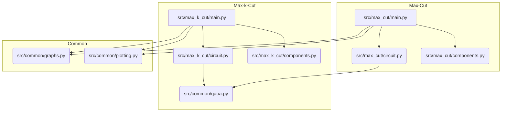

# QAOA per Max-Cut e Max-k-Cut

Questo progetto implementa l'algoritmo **Quantum Approximate Optimization Algorithm (QAOA)** per risolvere problemi di ottimizzazione combinatoria su grafi, nello specifico **Max-Cut** e **Max-k-Cut**.

L'implementazione utilizza **PennyLane**, una libreria cross-platform per il calcolo quantistico differenziabile, integrata con **NetworkX** per la gestione dei grafi.

## 🚀 Novità del Refactoring
Il progetto è stato recentemente refactorizzato per migliorare la modularità e ridurre la duplicazione del codice:
- **Core Centralizzato**: Tutta la logica di generazione circuiti e visualizzazione è ora in `src/common`.
- **Dashboard Unificata**: Un unico strumento di plotting per entrambi i problemi.
- **Interfaccia CLI Migliorata**: Script interattivi più robusti basati sulla libreria `rich`.

## 📂 Struttura del Progetto

Il codice è stato esteso introducendo pipeline di **Benchmarking** e passando all'utilizzo di **Qiskit** per l'infrastruttura quantistica più scalabile:

```text
QAOA/
├── docs/                 # Documentazione teorica generale e analisi tesi
│   ├── benchmark_analysis.md           # Analisi qualitativa dei risultati del benchmark
│   └── qaoa_teoria_e_ottimizzazione.md # Guida al funzionamento di QAOA e Gradient Descent
├── notebooks/            # Jupyter Notebooks di presentazione e didattica
│   ├── Presentazione_QAOA.ipynb        # Notebook passo-passo per Google Colab o Jupyter
│   └── Studio_Gradient_Descent.ipynb   # Notebook focalizzato sullo studio del Gradient Descent
├── scripts/              # Script di utilità e visualizzazioni globali
│   ├── generate_gd_notebook.py         # Generatore statico del notebook di studio del GD
│   ├── generate_notebook.py            # Generatore statico del notebook di presentazione
│   ├── test_pulp.py                    # Test di integrità del solutore classico ILP
│   ├── test_sampler.py                 # Test di integrità del Sampler Qiskit
│   ├── visualize_benchmark_graph.py    # Script per ispezionare singolarmente i grafi del dataset
│   └── visualize_results.py            # Script per tracciare grafici statistici dal benchmark
├── src/                  # Codice sorgente dell'infrastruttura QAOA
│   ├── common/            # Utility condivise usate dalle demo classiche
│   │   ├── graphs.py      # Generatore di grafi (Ciclo, Completo, Casuale, Petersen, etc.)
│   │   ├── plotting.py    # Dashboard 1x3 unificata per la visualizzazione grafica
│   │   └── qaoa.py        # Factory base per i circuiti quantistici
│   ├── data/              # Gestione dataset e soluzioni matematiche esatte
│   │   ├── exact_maxcut_solver.py    # Risolve il MaxCut in modo esatto via brute-force e ILP
│   │   └── graph_dataset_generator.py # Genera dataset di grafi randomizzati (.gpickle)
│   ├── max_cut/           # Modulo Max-Cut (2 partizioni)
│   │   ├── circuit.py     # Definizione del QNode per Max-Cut
│   │   ├── components.py  # Costruzione Hamiltoniane base (H_cost, H_mixer)
│   │   └── main.py        # Demo interattiva classica per Max-Cut
│   ├── max_k_cut/         # Modulo Max-k-Cut (k partizioni)
│   │   ├── circuit.py     # Definizione del QNode (n*k qubit, one-hot encoding)
│   │   ├── components.py  # Hamiltoniane modificate con metodo di penalità
│   │   └── main.py        # Demo interattiva classica per Max-k-Cut
│   ├── qaoa/              # Modulo avanzato di esecuzione QAOA basato su Qiskit Primitives
│   │   ├── ansatz.py      # Crea il QAOA Ansatz parametrizzato
│   │   ├── encoding.py    # Strategie per la rappresentazione e codifica quantistica
│   │   ├── optimizer.py   # Ciclo di ottimizzazione classica (COBYLA/GD)
│   │   ├── qaoa_runner.py # Esegue una singola configurazione QAOA
│   │   └── execute_benchmarking.py # Script centrale di QAOA Benchmarking
│   └── visualization/     # Strumenti di visualizzazione avanzati
│       ├── plot_gradient_descent.py # Visualizza traiettoria GD 3D sul panorama del costo
│       └── plotter.py     # Generazione di grafici statistici dai risultati JSON
└── tests/                # Test di unità e di integrazione (pytest)
```

## 🛠️ Requisiti

Assicurati di avere installato le dipendenze:
```bash
pip install -r requirements.txt
```

Librerie principali: `pennylane`, `qiskit`, `pulp`, `networkx`, `matplotlib`, `rich`, `scipy`, `tqdm`.

## 💻 Come Eseguire e Comandi del Progetto

Tutti i comandi devono essere eseguiti dalla directory root del progetto. Di seguito è riportata la lista completa dei comandi disponibili, con una breve spiegazione del loro scopo e i link alle rispettive guide teorico-matematiche:

### 1. Demo Max-Cut (Pennylane)
Risolve interattivamente il problema del taglio massimo (a 2 partizioni) su un grafo a scelta dell'utente utilizzando Pennylane.
* **Comando**:
  ```bash
  export PYTHONPATH=$PYTHONPATH:$(pwd)/src
  python src/max_cut/main.py
  ```
* **Documentazione Matematica & Grafici**: Vedere [src/max_cut/main.md](file:///home/angelo/Scrivania/UNI/Tesi/QAOA/src/max_cut/main.md).

### 2. Demo Max-k-Cut (Pennylane)
Risolve il problema del taglio massimo esteso a $k$ partizioni tramite one-hot encoding e penalizzazione dei vincoli.
* **Comando**:
  ```bash
  export PYTHONPATH=$PYTHONPATH:$(pwd)/src
  python src/max_k_cut/main.py
  ```
* **Documentazione Matematica & Grafici**: Vedere [src/max_k_cut/main.md](file:///home/angelo/Scrivania/UNI/Tesi/QAOA/src/max_k_cut/main.md).

### 3. Pipeline di Benchmarking QAOA (Qiskit)
Esegue un benchmark completo dell'algoritmo QAOA su un intero dataset di grafi randomizzati, confrontando le prestazioni quantistiche con la soluzione esatta classica calcolata tramite ILP.
* **Comandi Base e Opzioni**:
  Lo script supporta l'esecuzione separata delle fasi e la scelta dinamica dell'algoritmo di ottimizzazione tramite flag da riga di comando:
  ```bash
  export PYTHONPATH=$PYTHONPATH:$(pwd)
  
  # 1. Esegui l'intera pipeline (Default)
  python -m src.qaoa.execute_benchmarking
  
  # 2. Esegui solo il setup matematico (generazione grafi e calcolo esatto via ILP)
  python -m src.qaoa.execute_benchmarking --setup-only
  
  # 3. Esegui solo QAOA su grafi preesistenti, scegliendo gli algoritmi (es. COBYLA e GD)
  python -m src.qaoa.execute_benchmarking --qaoa-only --optimizers COBYLA GD
  ```
* **Documentazione Matematica & Metriche**: Vedere [src/qaoa/execute_benchmarking.md](file:///home/angelo/Scrivania/UNI/Tesi/QAOA/src/qaoa/execute_benchmarking.md).

### 4. Ispezione Grafi del Benchmark
Consente di esplorare graficamente e in modo interattivo la partizione esatta calcolata tramite ILP per un qualunque grafo salvato nel dataset di benchmark.
* **Comando**:
  ```bash
  export PYTHONPATH=$PYTHONPATH:$(pwd)
  python scripts/visualize_benchmark_graph.py
  ```
* **Documentazione Grafica**: Vedere [scripts/visualize_benchmark_graph.md](file:///home/angelo/Scrivania/UNI/Tesi/QAOA/scripts/visualize_benchmark_graph.md).

### 5. Analisi Grafica, Statistica e Infografiche Specifiche
Estrae i dati JSON generati dal benchmark. Tramite un **menu interattivo** permette di:
1. Tracciare i **grafici statistici globali** (Approximation Ratio vs N, p, densità).
2. Filtrare il dataset (per N, D, p, algoritmo, ID) per esplorare **grafici specifici** di una singola esecuzione (come la traccia di convergenza dell'ottimizzatore o l'istogramma delle probabilità).
* **Comando**:
  ```bash
  python scripts/visualize_results.py
  ```
* **Documentazione Grafica**: Vedere [scripts/visualize_results.md](file:///home/angelo/Scrivania/UNI/Tesi/QAOA/scripts/visualize_results.md).

### 6. Visualizzazione 3D Traiettoria Gradient Descent (GD)
Calcola e renderizza in una finestra GUI 3D interattiva il panorama continuo di costo $-\langle C(\gamma, \beta) \rangle$ e mostra il percorso intrapreso dall'ottimizzatore personalizzato a discesa di gradiente.
* **Comando**:
  ```bash
  python -m src.visualization.plot_gradient_descent
  ```
* **Documentazione Matematica & Discrepanza Superficie**: Vedere [src/visualization/plot_gradient_descent.md](file:///home/angelo/Scrivania/UNI/Tesi/QAOA/src/visualization/plot_gradient_descent.md).

## 🧠 Descrizione Algoritmi

### Max-Cut
L'obiettivo è partizionare i nodi di un grafo in due set tali che il numero di archi che collegano i due set sia massimizzato. QAOA mappa questo problema su un sistema di qubit dove ogni qubit rappresenta un nodo.

### Max-k-Cut
Estensione a *k* partizioni. Utilizziamo un **one-hot encoding**: ogni nodo è rappresentato da *k* qubit. Un termine di penalità nell'Hamiltoniana di costo assicura il vincolo che ogni nodo sia assegnato a esattamente un colore:
$$H_{penalty} = \alpha \sum_i (\sum_s n_{i,s} - 1)^2$$

## 📊 Visualizzazione
Al termine di ogni esecuzione, verrà generata una **Dashboard di Analisi** contenente:
1. **Grafo del Problema**: Visualizzazione della struttura originale.
2. **Distribuzione di Probabilità**: Gli stati misurati dal computer quantistico (vengono evidenziati i più probabili).
3. **Soluzione Ottimale**: Il grafo colorato secondo la partizione migliore trovata.

---
*Progetto sviluppato nell'ambito della tesi di laurea in Informatica.*

## 🗺️ Mappa del Codice e Flusso Logico

### Grafico delle Dipendenze Modulari

Questo grafico illustra le dipendenze interne tra i vari moduli del progetto. Le frecce indicano che un modulo importa o utilizza funzionalità da un altro.



### Flusso Logico dell'Applicazione

Questo diagramma rappresenta il flusso di esecuzione tipico degli script `main.py` per Max-Cut e Max-k-Cut, dopo il refactoring che ha snellito la logica.

```mermaid
flowchart TD
    start("Start (main.py)")
    start --> getUserInput("1. Get User Input (Graph & Params)")
    getUserInput --> setupQAOA("2. Setup QAOA Components (Hamiltonians, Circuits)")
    setupQAOA --> optimizeQAOA("3. Optimize QAOA Parameters")
    optimizeQAOA --> displayResults("4. Display Results (Optimal Bitstring, Plotting)")
    displayResults --> manualInspection("5. Manual Solution Inspection (Loop)")
    manualInspection --> end("End")
```

