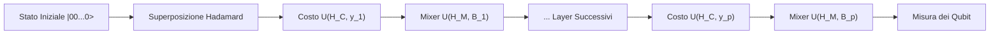

# Guida Teorica e Pratica al QAOA (Quantum Approximate Optimization Algorithm)

Questo documento descrive in dettaglio il funzionamento del QAOA, il ruolo dei parametri variazionali $\gamma$ e $\beta$, l'esecuzione dell'algoritmo all'interno dei singoli layer e i meccanismi del ciclo di ottimizzazione classica tramite la discesa del gradiente numerica.

---

## 1. Introduzione al QAOA
Il **Quantum Approximate Optimization Algorithm (QAOA)** è un algoritmo variazionale ibrido (classico-quantistico) formulato da Farhi, Goldstone e Gutmann nel 2014. È progettato per trovare soluzioni approssimate a problemi di ottimizzazione combinatoria (come il MaxCut) sfruttando i principi della meccanica quantistica.

L'idea cardine è quella di preparare uno stato quantistico parametrizzato $|\psi(\vec{\gamma}, \vec{\beta})\rangle$ su un computer quantistico (o simulatore) e utilizzare un ottimizzatore classico per aggiornare iterativamente i parametri $\vec{\gamma}$ e $\vec{\beta}$ per minimizzare il valore atteso dell'energia del problema.

---

## 2. Il Significato degli Angoli $\gamma$ e $\beta$
Nel QAOA a $p$ layer, lo stato quantistico viene manipolato applicando alternativamente due tipi di operatori quantistici. Gli angoli $\gamma$ e $\beta$ controllano la "durata" o "ampiezza" di queste applicazioni.

### A. L'Angolo $\gamma$ (Parametro dell'Hamiltoniana di Costo $H_C$)
L'Hamiltoniana di costo $H_C$ codifica le regole del problema matematico che vogliamo risolvere. Per il problema del MaxCut su un grafo $G = (V, E)$, l'Hamiltoniana è espressa in termini di operatori di spin di Pauli $Z$:

$$H_C = \frac{1}{2} \sum_{(u,v) \in E} (I - Z_u Z_v)$$

L'operatore unitario associato è:

$$U(H_C, \gamma) = e^{-i \gamma H_C} = \prod_{(u,v) \in E} e^{-i \frac{\gamma}{2} (I - Z_u Z_v)}$$

*   **Significato Fisico:** Rappresenta una rotazione di fase quantistica. Ciascuno stato della base computazionale (es. $|1010\rangle$) accumula una fase quantistica proporzionale al numero di vincoli (archi tagliati) che soddisfa. 
*   **Ruolo pratico:** $\gamma$ serve a **marcare matematicamente** le configurazioni corrette modificando la loro fase quantistica rispetto alle altre.

### B. L'Angolo $\beta$ (Parametro dell'Hamiltoniana di Mixer $H_M$)
L'Hamiltoniana di mixer (o di miscelazione) $H_M$ introduce le transizioni quantistiche tra i diversi stati. Solitamente è definita come la somma degli operatori di Pauli $X$ su ciascun qubit:

$$H_M = \sum_{u \in V} X_u$$

L'operatore unitario associato è:

$$U(H_M, \beta) = e^{-i \beta H_M} = \prod_{u \in V} e^{-i \beta X_u} = \prod_{u \in V} R_X(2\beta)$$

*   **Significato Fisico:** Corrisponde ad applicare una rotazione di un angolo $2\beta$ attorno all'asse $X$ della sfera di Bloch per ciascun qubit.
*   **Ruolo pratico:** Agisce come un termine di **diffusione** o di **tunneling quantistico**. Consente di ridistribuire le ampiezze di probabilità tra gli stati quantistici, inducendo interferenza costruttiva per gli stati contrassegnati come "soluzioni ottime" da $\gamma$, e interferenza distruttiva per gli altri.

---

## 3. L'Esecuzione dell'Algoritmo in Ogni Layer
L'algoritmo prepara lo stato iniziale in una superposizione uniforme applicando porte di Hadamard ($H$) a tutti i qubit nello stato fondamental $|0\rangle^{\otimes N}$:

$$|s\rangle = H^{\otimes N} |0\rangle^{\otimes N} = \frac{1}{\sqrt{2^N}} \sum_{x \in \{0,1\}^N} |x\rangle$$

Ciascun **layer** (o livello $p$) dell'algoritmo consiste nell'applicazione consecutiva dei due operatori unitari di costo e di mixer:

### Relazione con l'Evoluzione Adiabatica
Dal punto di vista teorico, il QAOA è una versione discretizzata (tramite la formula di Trotter-Suzuki) dell'**AQC (Adiabatic Quantum Computation)**. 
Secondo il teorema adiabatico, se partiamo dallo stato fondamentale del Mixer $H_M$ e modifichiamo molto lentamente il sistema fino all'Hamiltoniana $H_C$, il sistema rimarrà nello stato fondamentale di $H_C$, che rappresenta la soluzione ottimale. 
All'aumentare dei layer $p \to \infty$, il QAOA converge matematicamente con probabilità pari a $1$ all'evoluzione adiabatica ideale.

---

## 4. Il Ciclo di Ottimizzazione Classica
Poiché le misure quantistiche restituiscono stringhe binarie in modo probabilistico, l'ottimizzatore classico non valuta una singola soluzione ad ogni passo, ma lavora sul **valore atteso dell'energia** (Expectation Value) dello stato quantistico generato dai parametri $(\vec{\gamma}, \vec{\beta})$:

$$\langle H_C \rangle_{(\vec{\gamma}, \vec{\beta})} = \langle \psi(\vec{\gamma}, \vec{\beta}) | H_C | \psi(\vec{\gamma}, \vec{\beta}) \rangle$$

Nel nostro codice, questo valore atteso è calcolato come valore medio del taglio classico ponderato per le probabilità di misura ottenute eseguendo il circuito per un certo numero di *shots* (campionamenti):

$$E(\vec{\gamma}, \vec{\beta}) = \sum_{x} P(x; \vec{\gamma}, \vec{\beta}) \cdot C(x)$$

Poiché vogliamo massimizzare il taglio medio, definiamo la funzione obiettivo da minimizzare come:

$$f(\vec{\gamma}, \vec{\beta}) = - E(\vec{\gamma}, \vec{\beta})$$

### La Discesa del Gradiente (Gradient Descent)
L'ottimizzatore a discesa del gradiente calcola la derivata parziale (pendenza) della funzione obiettivo rispetto a ciascun angolo parametro per determinare in quale direzione i parametri devono muoversi per ridurre il costo.

Il vettore gradiente è:

$$\nabla f(\gamma, \beta) = \begin{bmatrix} \frac{\partial f}{\partial \gamma} \\ \frac{\partial f}{\partial \beta} \end{bmatrix}$$

L'aggiornamento dei parametri avviene muovendosi in direzione opposta al gradiente:

$$\gamma_{k+1} = \gamma_k - \eta \frac{\partial f}{\partial \gamma}$$

$$\beta_{k+1} = \beta_k - \eta \frac{\partial f}{\partial \beta}$$

Dove $\eta$ è il *learning rate* (passo di apprendimento).

### Stima Numerica tramite Differenze Finite Centrali
Non potendo calcolare analiticamente le derivate sulla macchina quantistica, il codice approssima la pendenza perturbando localmente i parametri di una quantità $dx = 0.2$:

$$\frac{\partial f}{\partial \gamma} \approx \frac{f(\gamma + dx, \beta) - f(\gamma - dx, \beta)}{2 \cdot dx}$$

Un valore di $dx$ sufficientemente grande (come $0.2$) protegge il calcolo del gradiente dal rumore statistico intrinseco dovuto al numero finito di campionamenti (shots) effettuati sul circuito.
Al termine di ogni aggiornamento, i parametri vengono mappati all'interno del loro intervallo periodico tramite operazione modulo:
*   $\gamma \in [0, 2\pi]$ (periodicità di $H_C$)
*   $\beta \in [0, \pi]$ (periodicità di $H_M$)

### Nota sulla Visualizzazione
Nei grafici e nei report di analisi, per motivi di chiarezza e interpretabilità immediata, mostriamo direttamente il **valore atteso positivo del taglio $\langle C \rangle = E(\vec{\gamma}, \vec{\beta})$** anziché il costo negativo $f(\vec{\gamma}, \vec{\beta})$. 
In questo modo, la discesa del gradiente del costo si traduce visivamente in una **salita del gradiente** (Gradient Ascent) del valore atteso del taglio lungo i picchi della mappa, che converge asintoticamente verso il taglio massimo teorico (pari a $4.0$).

